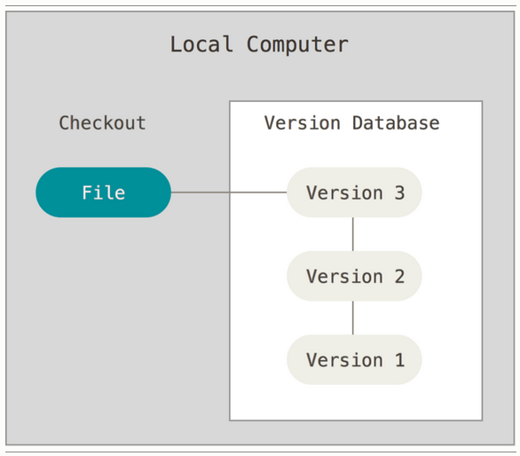
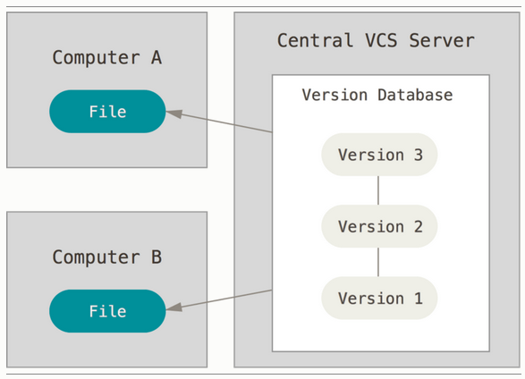
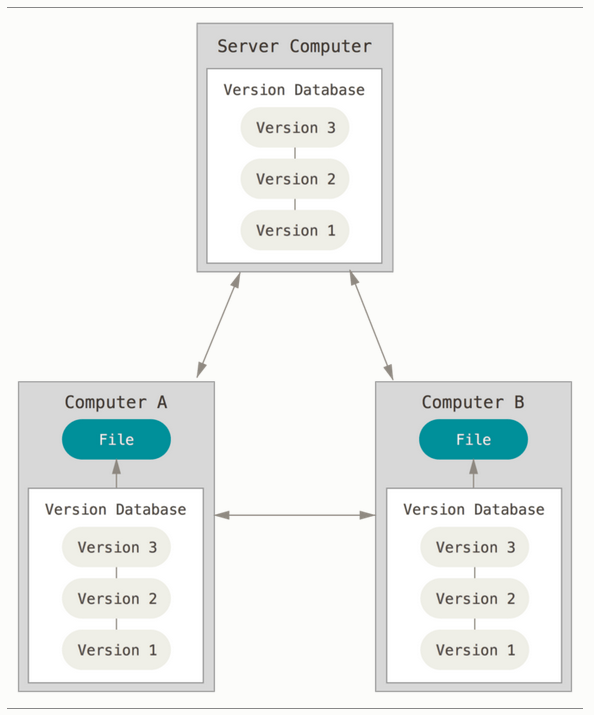

# On version control

## Intro to version control with Git

Note: most of this is taken from the [git training](https://github.com/pyladieslondon/git-training) I wrote for a PyLadies London meetup.

See lightning talk slides for that meetup [here](http://nbviewer.ipython.org/github/pyladieslondon/git-training/blob/master/PyLadiesLondon-Git.ipynb)

###About version control

Version control is a system to help keep track of file changes over time.
It can be use for code or any other kind of file (text, images...).

Using version control enables you to go back to a previous version of your work, to compare the changes and it can serve as backup.

You would typically have a local version of your work on your computer and a remote repository on a server (a widely used tools for remote repositories is [Github](http://github.com/)).


Read more [here](https://git-scm.com/book/en/v2/Getting-Started-About-Version-Control).


### Brief history of Git

Git was created by the Linux development community in 2005 as a version control tool for the Linux kernel.

Here are the main property they develop Git on:

* Speed
* Simple design
* Strong support for non-linear development (thousands of parallel branches)
* Fully distributed
* Able to handle large projects like the Linux kernel efficiently (speed and data size)


### About Git

Git works by taking a snapshot of your files over time and stores a reference to be able to go back to each snapshot if needed.

You can go through all the changes in the history of your project on your local machine so you can work offline.

Git has three main states for your file to be in:

* modified: you have changed the file locally but haven't commited it,
* staged: you have marked the modified file in its current version to go into your next commit snapshot,
* committed: the snapshot is saved and referenced.


Here what a basic Git workflow looks like:

1. You modify files in your working directory.

2. You stage the files, adding snapshots of them to your staging area.

3. You do a commit, which takes the files as they are in the staging area and stores that snapshot permanently to your Git directory.


### Basic use of Git

There are several graphic user interfaces (GUIs) available for Git but it is highly recommanded to learn the basic commands to use on a terminal.

The first thing to do is to initialise a Git repository:
```
~$ git init
```

Once you have made changes (file modified) you stage the file:
```
~$ git add my-name.py
```

Then you commit your changes:
```
~$ git commit -m "initial version"
```

You can update a remote repository:
```
~$ git push origin master
```

Note: to start using an existing repository you clone it (usually from a Github project):
```
~$ git clone https://github.com/user-name/repository-name.git
```

For more details: check the extensive [documentation](https://git-scm.com/doc).


## Git isn't the only version control system

I wrote this intro with Git in mind because it is the version control system (VCS) I know best.

Version control started with local VCS to keep track of the different versions of a file.


image from Git documentation

This becomes limited when working on a project with other people.

That's why teams usually choose Git, Subversion (svn) or Mercurial (hg).
See this Stackoverflow [thread](http://stackoverflow.com/questions/3183064/git-vs-mercurial-vs-svn) where people compare those three VCS.

They are different as Subversion has a single central repository.


image from Git documentation

Git and Mercurial unlike Subversion are distributed and are therefore more suited for a team to work on the same project.


image from Git documentation


## Git servers

**Important note for junior programmers: Git != Github**

In order to collaborate using git you need to create a remote repository on a git server.
People will push and pull changes from this remote repository to their local instance.

You can set up your own git server, but most teams go for a fully featured git servers.
Using Github or Bitbucket can be as simple as signing up to the web apps while GitLab needs to be installed on your server.
Github and Bitbucket can also be run on your own server. See a comparison of the three services on this [blogpost](https://technologyconversations.com/2015/10/16/github-vs-gitlabs-vs-bitbucket-server-formerly-stash/).
